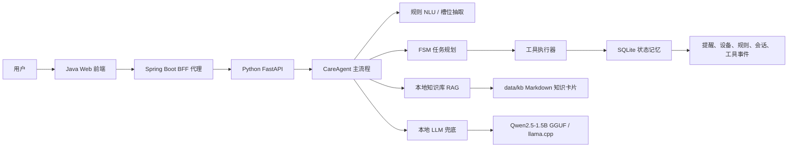

# 老人关怀端侧智能体创新方案文档

## 1. 场景选择与痛点分析

本项目选择“家庭老人日常照护”作为应用场景，围绕老人用药提醒、居家环境联动、本地知识问答和家属通知构建端侧智能体。该场景具备高频、刚需、隐私敏感和低资源设备可落地的特点，适合展示端侧 Agent 的任务理解、状态保持、工具调用和本地推理能力。

### 1.1 场景描述

系统面向一个典型家庭环境：

- 家中有一位老人，例如“奶奶”。
- 家属联系人包括儿子、女儿或主要联系人。
- 家中存在卧室、客厅等房间，以及空调、灯光、温湿度传感器等模拟设备。
- 用户通过文本对话完成提醒创建、提醒修改、环境查询、设备控制、知识问答和异常通知。

系统支持的典型交互包括：

- “明早 7 点提醒奶奶吃降压药。”
- “改成 7 点半。”
- “卧室现在多少度？”
- “如果卧室低于 20 度，晚上 9 点后自动开空调到 24 度。”
- “这个药饭前还是饭后吃？”
- “通知我儿子我今晚不舒服。”

### 1.2 核心痛点

**用药提醒依赖人工记忆。**  
老人慢病用药通常具有长期性、周期性和多药并行特点，单纯靠家属记忆或普通闹钟容易出现漏设、误改、重复提醒等问题。

**照护指令具有上下文依赖。**  
真实对话中用户经常省略上下文，例如先说“明早 7 点提醒奶奶吃降压药”，随后说“改成 7 点半”。系统需要理解“改成”指向最近的提醒，而不是新建一条提醒。

**家庭设备与健康照护割裂。**  
传统智能家居更关注设备控制本身，而老人照护需要把环境状态和健康场景关联起来，例如低温时自动打开空调，并保留规则和工具执行记录。

**医疗与照护知识需要安全边界。**  
用户会询问药品用法、饭前饭后、禁忌等问题。系统必须返回有来源的本地知识引用，同时避免生成真实诊断或替代医生建议。

**云端依赖带来隐私与稳定性风险。**  
老人健康、家庭联系人、用药记录都属于敏感信息。系统采用本地 SQLite、本地知识库和本地量化模型，主流程不依赖外网服务。

**端侧设备资源受限。**  
比赛强调低资源环境下的推理和实时响应。本项目采用规则优先、模型兜底、知识卡片检索和量化小模型，减少不必要的大模型调用。

### 1.3 项目目标

项目目标不是构建泛化医疗问答系统，而是在可控家庭照护场景中完成一个稳定、可解释、可演示的端侧智能体闭环：

- 能理解自然语言照护指令。
- 能规划并调用本地工具。
- 能维护多轮会话状态。
- 能基于本地知识库回答问题。
- 能在必要时调用本地 LLM 增强解析和表达。
- 能通过 Java Web 展示 Agent 的解析、计划、工具调用和性能指标。

## 2. 系统架构设计

系统采用“Python 算法主链路 + Java 本地展示层 + SQLite 本地记忆 + Markdown 知识库 + GGUF 本地模型”的分层架构。

### 2.1 总体架构



### 2.2 Python 算法层

Python 层是比赛主交付，入口文件为：

```text
algorithm/main.py
```

入口函数为：

```python
def run(argv: list[str] | None = None) -> None:
```

该入口同时支持三种运行方式：

- `--api`：启动 FastAPI 服务，供 Java 展示层调用。
- `--once`：执行单轮文本输入并输出 JSON，便于脚本测试。
- 无参数：进入本地 CLI 对话模式。

Python 核心代码位于：

```text
algorithm/agent_py
```

主要模块职责如下：

| 模块 | 职责 |
| --- | --- |
| `api.py` | 定义 FastAPI 接口，包括 chat、confirm、state、reset、健康检查等 |
| `engine.py` | Agent 主流程，串联 NLU、RAG、LLM、规划、工具和记忆 |
| `nlu.py` | 规则优先的意图识别、槽位抽取、时间解析、设备解析 |
| `tools.py` | 本地工具执行器，处理提醒、设备、传感器、通知和环境规则 |
| `memory.py` | SQLite 多表状态管理 |
| `rag.py` | 本地 Markdown 知识卡片检索 |
| `llm_adapter.py` | llama-cpp 本地 GGUF 模型加载、DLL 预加载和调用降级 |
| `models.py` | 内部数据结构定义 |
| `config.py` | 路径、模型、环境变量等配置 |

### 2.3 Java 展示层

Java 展示层位于：

```text
algorithm/showcase_java/showcase-server
```

Java 的定位是本地演示台和 BFF 代理，不实现算法逻辑：

- 前端只请求 Java。
- Java 统一代理到 Python API。
- Java 不读取 SQLite。
- Java 不调用外部 AI。
- Python 离线时，Java 返回统一错误结构，前端展示明确状态。

页面包括：

- `控制中心`：展示家庭设备、传感器、提醒摘要、环境规则、最近工具调用。
- `健康助手`：主 RAG 对话页，展示本轮意图、槽位、计划步骤、工具事件、知识引用和 LLM 状态。
- `待办列表`：展示提醒、环境规则、通知记录、工具事件，并支持提醒和规则的启用、停用、删除。
- `工具助手浮窗`：快捷工具入口，只处理短工具指令。

### 2.4 本地数据层

系统使用 SQLite 保存多轮状态和工具执行结果，数据库路径为：

```text
data/agent_state.sqlite3
```

主要数据表包括：

| 表 | 作用 |
| --- | --- |
| `sessions` | 会话级状态、pending action、最近意图、最近提醒 |
| `family_contacts` | 家属联系人 |
| `reminders` | 用药提醒 |
| `device_states` | 设备状态，包括空调温度和灯光亮度 |
| `sensors` | 传感器状态 |
| `env_rules` | 环境联动规则 |
| `tool_events` | 工具调用历史 |
| `conversation_messages` | 对话记录 |

采用多表关系结构的原因是：提醒、设备、规则、工具事件和对话历史都需要被前端分别展示和操作。相比单条 JSON，多表设计更便于查询、启停、删除、性能统计和后续扩展。

### 2.5 本地知识库

本地知识库位于：

```text
data/kb
```

知识以 Markdown 卡片维护，当前包括药品、用药提醒、环境规则、设备说明、照护边界和 Demo 脚本等内容。RAG 检索结果会返回标题、片段编号和片段摘要，前端可展示知识引用，避免回答看起来像模型编造。

## 3. AI 模型与算法说明

本项目采用“规则优先 + 有限状态机 + 本地 RAG + 小模型兜底”的混合智能方案。其核心思想是：端侧场景中高频任务应由可解释、低延迟的规则和工具链完成；只有规则覆盖不足或知识问答需要自然总结时，才调用本地 LLM。

### 3.1 意图识别与槽位抽取

系统支持的主要意图包括：

- 创建提醒：`create_reminder`
- 修改提醒：`update_reminder`
- 查询提醒：`query_reminder`
- 查询环境：`query_sensor`
- 控制设备：`control_device`
- 环境联动：`upsert_env_rule`
- 通知家属：`notify_family`
- 知识问答：`knowledge_query`
- 未知意图：`unknown`

规则 NLU 负责处理高频、结构明显的内容：

- 时间表达：明早、明天、7 点、7 点半、晚上 9 点后。
- 人物表达：奶奶、爷爷、儿子、女儿、家属。
- 药物表达：降压药、氨氯地平等。
- 房间表达：卧室、客厅。
- 设备表达：空调、灯。
- 动作表达：打开、关闭、调到、改成、提醒、通知。
- 灯光亮度表达：50%、调亮、调暗。
- 空调温度表达：24 度、调到 26 度。

规则解析成功时，系统不调用 LLM，从而获得更低延迟和更稳定的工具调用结果。

### 3.2 多轮对话与状态保持

系统通过 SQLite 保存会话状态，而不是把全部上下文硬塞进模型长上下文。典型状态包括：

- 最近一次意图。
- 最近创建或修改的提醒 ID。
- 当前 pending action。
- 最近工具调用事件。
- 会话消息。
- 当前设备和传感器状态。

例如：

1. 用户说：“明早 7 点提醒奶奶吃降压药。”
2. 系统创建 `rem-001`，并记录 `last_reminder_id=rem-001`。
3. 用户继续说：“改成 7 点半。”
4. 系统根据 `last_reminder_id` 修改原提醒，而不是新建提醒。

这种方式比依赖模型记忆更稳定，也更适合端侧设备持久运行。

### 3.3 FSM 任务规划

系统没有采用完全自由式链式推理，而是采用有限状态机规划：

```text
理解输入 -> 补槽判断 -> 生成工具步骤 -> 执行工具 -> 写入状态 -> 生成回复
```

有限状态机的优势是：

- 工具执行边界明确。
- 便于测试每类意图。
- 不容易出现模型直接编造工具参数的问题。
- 能把危险操作，例如通知家属，放入二次确认流程。

### 3.4 本地知识卡片式 RAG

本项目的 RAG 采用轻量关键词检索，而不是引入向量数据库。知识库由 Markdown 卡片组成，每张卡片包含标题、适用问题、系统口径、用法说明、安全边界等内容。

检索流程：

1. 判断输入是否属于知识问答。
2. 根据关键词、最近提醒药品和上下文构造查询。
3. 在 `data/kb` 中检索相关 Markdown 片段。
4. 返回知识引用，包括标题、片段 ID 和摘要。
5. 如果 LLM 可用，则让本地模型基于检索片段做自然语言总结。
6. 如果 LLM 不可用，则返回检索片段中的核心内容。

知识卡片式 RAG 的优点是：

- 不依赖向量数据库，部署轻。
- 知识来源可控，适合医疗照护安全边界。
- 便于人工维护和比赛演示。
- 命中结果可解释，前端能展示引用标题。
- 离线可运行。

局限是：泛化能力低于大规模向量知识库，需要为核心药品、设备和规则维护高质量卡片。

### 3.5 本地 LLM 使用方式

当前模型采用：

```text
Qwen2.5-1.5B-Instruct-GGUF / q5_k_m
```

模型路径：

```text
E:\app\llm_models\qwen2.5-1.5b-instruct-q5_k_m.gguf
```

推理后端：

```text
llama-cpp-python
```

LLM 主要承担两类工作：

**规则兜底解析。**  
当规则无法稳定解析意图和槽位时，LLM 只输出固定 JSON schema，例如：

```json
{
  "intent": "create_reminder",
  "slots": {
    "person": "奶奶",
    "medicine": "降压药",
    "time_text": "明天早晨七点"
  },
  "confidence": 0.72
}
```

系统会对 LLM 输出进行归一化，例如把 `drug`、`medicine_name` 合并为 `medicine`，把 `to`、`target` 合并为 `person`，自然语言时间再交给规则时间解析器处理。归一化后仍缺槽时，继续追问，而不是强行执行。

**RAG 总结表达。**  
当健康助手命中本地知识库，且用户输入包含明显疑问语气，例如“为什么”“怎么办”“可以吗”“饭前还是饭后”时，系统可调用本地 LLM，在知识片段范围内生成更自然的回答。

LLM 不直接访问外网，不生成真实医疗诊断，不绕过本地知识库和安全边界。

### 3.6 模型降级策略

系统设计了完整降级链路：

- 未配置模型路径：继续使用规则和 RAG 摘要。
- 模型文件不存在：健康检查提示原因，主流程不崩溃。
- DLL 预加载失败：记录 runtime 状态，规则流程继续工作。
- LLM 超时或 JSON 解析失败：丢弃模型结果，进入规则补槽或安全拒答。
- Java 或前端不直接依赖模型状态：只展示 `llm_used` 和 `llm_status`。

这保证了比赛演示时即使模型加载失败，提醒、设备、环境、确认和知识片段检索仍可运行。

## 4. 工具函数设计与调用逻辑

工具函数是 Agent 连接真实或模拟资源的边界。本项目将工具设计为本地可执行函数，并把每次调用写入 `tool_events`，便于前端展示和调试。

### 4.1 工具清单

| 工具名 | 作用 | 是否需要确认 |
| --- | --- | --- |
| `create_reminder` | 创建用药提醒 | 否 |
| `update_reminder` | 修改用药提醒 | 否 |
| `query_reminder` | 查询用药提醒 | 否 |
| `query_sensor` | 查询房间温湿度和活动状态 | 否 |
| `control_device` | 控制空调或灯光 | 单设备否，批量控制可确认 |
| `upsert_env_rule` | 创建或更新环境联动规则 | 否 |
| `notify_family` | 模拟通知家属 | 是 |

额外的待办列表管理接口包括：

- 删除提醒。
- 启用或停用提醒。
- 删除环境规则。
- 启用或停用环境规则。

### 4.2 提醒工具逻辑

创建提醒时，系统需要抽取：

- `person`：提醒对象。
- `medicine`：药品名称。
- `time`：标准时间。
- `time_text`：用户可读时间。

例如：

```text
用户：明早7点提醒奶奶吃降压药
工具：create_reminder
结果：奶奶 明天 07:00 吃降压药
```

修改提醒时，系统优先使用最近提醒 ID。如果用户没有指定具体提醒，但上下文中有最近提醒，则执行更新；如果上下文不足，则追问。

### 4.3 设备与传感器工具逻辑

传感器状态由本地模拟数据提供：

- 卧室温度。
- 客厅温度。
- 湿度。
- 活动状态。

设备状态包括：

- 空调：`status` 和 `target_temp`。
- 灯：`status` 和 `brightness`。

示例：

```text
用户：把卧室空调调到 26 度
工具：control_device
状态：卧室空调 on，target_temp=26
```

```text
用户：把客厅灯调到 60%
工具：control_device
状态：客厅灯 on，brightness=60
```

### 4.4 环境联动工具逻辑

环境规则用于把传感器状态和设备控制关联起来。规则字段包括：

- 房间。
- 比较符，例如低于、高于。
- 阈值，例如 20 度。
- 生效时间，例如晚上 9 点后。
- 目标设备。
- 动作。
- 目标温度或亮度。
- 是否启用。

当前版本不做后台定时调度，而是在创建规则后立即进行一次本地模拟评估：

```text
用户：如果卧室低于20度，晚上9点后自动开空调到24度
工具步骤1：upsert_env_rule
工具步骤2：env_rule_immediate_check
工具步骤3：control_device
```

如果当前卧室温度为 19 度，规则满足低于 20 度，系统会立即把卧室空调设为开启并设置目标温度 24 度，用于演示规则闭环。

### 4.5 通知家属确认逻辑

通知家属属于敏感动作，必须二次确认。

流程如下：

1. 用户说：“通知我儿子我今晚不舒服。”
2. 系统创建 pending action，但不立即执行。
3. 前端显示“是否通知儿子？”
4. 用户点击确认。
5. 系统调用 `notify_family`，写入工具事件。
6. 如果重复确认同一个 action，系统不会重复执行。

这种设计避免误触发通知，也能展示 Agent 的安全执行边界。

### 4.6 不同前端入口的调用策略

前端有两个对话入口：

| 入口 | mode | 行为 |
| --- | --- | --- |
| 健康助手 | `health_assistant` | 支持 RAG 问答，也支持工具调用 |
| 工具助手浮窗 | `tool_short` | 只处理工具类指令，回复短句 |

如果用户在工具浮窗询问知识问题，系统不会调用 RAG，而是提示用户到健康助手中提问。这保证了演示逻辑清晰：主页面展示完整 Agent 过程，浮窗只做快捷控制。

### 4.7 工具事件可观测性

每次工具调用都会记录：

- 工具名称。
- 输入参数。
- 输出结果。
- 是否成功。
- 时间戳。

前端可以展示最近工具调用、待办列表工具事件和本轮执行时间线。这样答辩时可以清楚说明：系统不是只返回聊天文本，而是确实把自然语言转成了可执行工具流程。

## 5. 性能优化措施

本项目的性能优化目标是在本地低资源环境中保持稳定响应，并控制内存占用和模型调用次数。

### 5.1 规则优先，减少模型调用

老人照护场景中，大量指令具有明确结构，例如提醒、改时间、查温度、开空调、通知家属。系统优先使用规则解析这些高频指令，避免每轮都调用 LLM。

这样带来三个收益：

- 响应延迟低。
- 行为可解释。
- 结果更稳定，不容易因模型输出波动影响工具调用。

### 5.2 小模型量化部署

LLM 选用 1.5B 级别模型，并使用 GGUF `q5_k_m` 量化格式。相比更大的 7B 或 14B 模型，该选择更符合端侧演示的资源约束：

- 模型体积更小。
- CPU 可运行。
- 可选 GPU layers 加速。
- 对意图槽位兜底和 RAG 总结已经够用。

默认启动参数中：

```text
ZTECOM_LLM_N_CTX=2048
ZTECOM_LLM_MAX_TOKENS=256
ZTECOM_RAG_LLM_MAX_TOKENS=160
ZTECOM_LLM_TEMPERATURE=0.1
```

这些配置限制上下文长度和生成长度，减少长文本生成带来的延迟。

### 5.3 LLM 懒调用与失败降级

健康检查只检查模型文件、运行时和配置状态，不强制预加载模型，避免启动阶段耗时过长。

LLM 只有在以下情况才调用：

- 规则无法完整解析。
- 明显疑问句命中知识库后需要自然总结。
- 需要展示模型兜底能力的复杂表达。

如果 LLM 失败，系统不会中断主流程，而是退回规则补槽、RAG 摘要或明确拒答。

### 5.4 本地关键词 RAG

当前知识库规模较小，采用 Markdown 知识卡片加关键词检索，避免引入向量数据库、embedding 模型和额外索引服务。

该策略适合比赛阶段：

- 零外部服务依赖。
- 启动快。
- 检索结果容易解释。
- 知识卡片可人工维护。
- 资源占用低。

如果后续知识规模扩大，可以平滑升级为 embedding + 向量索引。

### 5.5 SQLite 本地存储

SQLite 适合单用户、本地演示和端侧部署：

- 无需独立数据库服务。
- 读写开销低。
- 文件便于打包。
- 支持关系表查询。
- 便于前端展示提醒、规则、事件和会话。

### 5.6 前后端分层减小耦合

Java 只做 BFF 代理和页面展示，Python 只做算法主链路。这样可以避免 Java 和 Python 重复维护业务逻辑，也便于性能定位：

- Python 慢：检查 Agent、RAG、LLM、SQLite。
- Java 异常：检查代理和静态页面。
- 前端显示异常：检查 Java 返回 JSON 和页面渲染。

### 5.7 性能测试与观测

项目提供性能测试脚本：

```text
algorithm/benchmark_demo.py
```

测试覆盖：

- 8 个 Demo。
- RAG 问答。
- LLM 兜底样例。
- 连续 30 轮稳定性。
- p50、p95、max 延迟。
- 成功率。
- 工具事件统计。
- LLM 调用次数。

性能报告输出到：

```text
data/docs/performance.md
```

当前性能结果表明：规则命中的任务延迟极低，LLM 兜底任务耗时明显更高，因此“规则优先、模型兜底”的架构选择是合理的。

## 6. 可扩展性与实用性评估

### 6.1 可扩展性

**工具扩展。**  
当前工具执行器已经把工具调用与 Agent 主流程解耦。后续可以增加真实短信、电话、智能家居协议、蓝牙设备、开发板 GPIO、MQTT 或 Home Assistant 接入。新增工具只需要扩展工具 schema、执行函数和必要的确认策略。

**知识库扩展。**  
当前知识库是 Markdown 卡片。后续可以扩展更多药品、慢病管理、设备说明、康复训练和家庭应急流程。卡片数量增加后，可以升级为：

- Markdown 切片索引。
- BM25 检索。
- embedding 向量检索。
- 混合检索。
- 药品别名词典和症状映射表。

**模型扩展。**  
当前使用 Qwen2.5-1.5B-Instruct GGUF。后续可以根据硬件能力替换为：

- 更小模型：提升速度，适合低功耗设备。
- 更大模型：提升复杂表达理解能力。
- 专门微调模型：提升老人照护领域意图槽位解析能力。
- 蒸馏模型：压缩大模型能力到端侧小模型。

只要保持 LLM adapter 的输入输出 schema 不变，Agent 主流程不需要大改。

**多模态扩展。**  
当前版本只做文本输入输出。后续可扩展：

- 语音识别和语音播报。
- 摄像头跌倒检测。
- 智能手环数据接入。
- 开发板传感器采集。
- 家庭异常事件识别。

这些能力可以作为新的工具或传感器数据源接入现有 Agent。

**多用户扩展。**  
当前默认单家庭、单老人、单 session。SQLite 表结构已经带有 `session_id`，后续可以扩展为多家庭、多老人、多联系人模型。

### 6.2 实用性

**端侧可运行。**  
系统主流程全部本地执行，不依赖云端 LLM。即使断网，提醒、设备模拟、环境联动、SQLite 状态和本地知识库仍可运行。

**可解释。**  
前端不仅展示最终回答，还展示意图、槽位、计划步骤、工具事件、知识引用和延迟。相比普通聊天机器人，更容易证明系统具备 Agent 任务执行能力。

**安全边界清晰。**  
通知家属需要确认；药品问题基于本地知识库引用；系统明确不替代医生诊断；LLM 结果不能绕过工具补槽和确认流程。

**部署简单。**  
Python 使用固定 Conda 环境，Java 使用 Spring Boot，本地通过脚本启动：

```powershell
powershell -ExecutionPolicy Bypass -File .\algorithm\showcase_java\showcase-server\start-showcase.ps1 -RestartPython 1 -RestartJava 1 -GpuLayers 20
```

比赛入口仍满足：

```text
程序名：main.py
入口函数：run()
```

即：

```text
algorithm/main.py
```

中的：

```python
run()
```

### 6.3 当前限制

当前版本仍有一些有意保留的边界：

- 家属通知为本地模拟，不发送真实短信或电话。
- 设备和传感器为本地模拟，不接真实硬件。
- 环境联动只做创建后的即时评估，不做后台定时调度。
- RAG 知识库依赖人工维护，不追求通用医疗知识覆盖。
- LLM 只做兜底解析和基于知识片段的总结，不直接生成医疗建议。

这些限制是为了保证比赛阶段系统可控、稳定、可解释。

### 6.4 创新点总结

本项目的创新点主要体现在：

- 将老人照护场景拆解为可执行的端侧 Agent 工具链，而不是只做聊天问答。
- 使用规则优先和 LLM 兜底结合，兼顾低延迟和自然语言泛化能力。
- 使用 SQLite 多表记忆实现多轮状态保持和前端可观测展示。
- 使用知识卡片式 RAG，在医疗照护场景中提供可维护、可引用、可控的本地知识问答。
- 将健康助手和工具浮窗分流，分别服务完整 RAG 问答和短工具指令。
- 通过 Java 展示层把意图、槽位、工具调用、知识引用和性能指标显式呈现，增强答辩可解释性。

综合来看，该系统在低资源约束下实现了“自然语言理解 -> 任务规划 -> 工具调用 -> 状态记忆 -> 本地知识问答 -> 可视化展示”的完整闭环，符合端侧智能体比赛对实用性、创新性和可落地性的要求。
